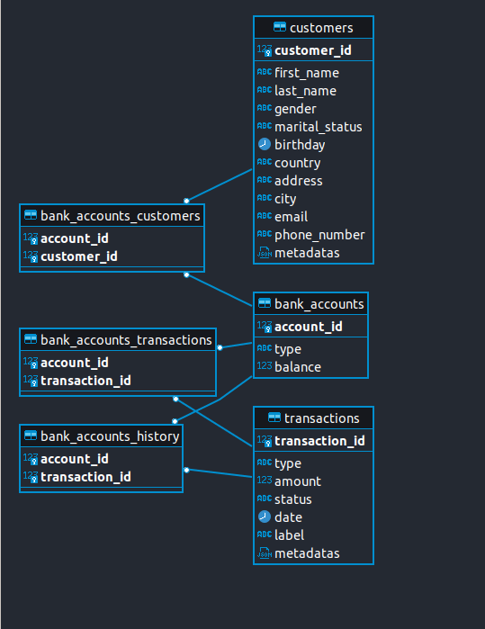

# Bank Account Quarkus 🏦 


# Sommaire
1. [Directives](#Directives-)
2. [Solution](#Solution-)


## Directives 🥅

*Ce kata est un challenge d'architecture hexagonale, il s'implémente par étape avec un 1er focus sur le domaine métier.
Vos commits successifs dans Git retranscrivent vos étapes et le cycle TDD red/green/refactor si vous décidez de l'adopter.*

#### 1: Le modèle métier
1. cette étape est essentielle, vous devez vous concentrer sur le modèle métier : simple, efficace et non-anémique.
Vous l'isolez derrière les ports.

**ATTENTION - CETTE PREMIERE ETAPE EST PRIMORDIALE**
- Elle devra être matérialisée proprement dans vos commits.
- Elle est attendue par nos clients et ne devrait pas excéder 2h d'implémentation.

#### Etape 2 - Adapteur API
Implémentation d'un adapteur Spring qui expose l'application en respectant les meilleurs standards d'une REST API.

#### Etape 3 - Adapteur de Persistence
Implémentation d'un adapteur de persistence de votre choix (SQLlite, H2, ...).

User Stories

In order to implement this Kata, think of your personal bank account experience.
When in doubt, go for the simplest solution Requirements

* Deposit and Withdrawal
* Account statement (date, amount, balance)
* Statement printing
 

#### User Story 1

In order to save money

As a bank client

I want to make a deposit in my account


#### User Story 2

In order to retrieve some or all of my savings

As a bank client

I want to make a withdrawal from my account


#### User Story 3

In order to check my operations

As a bank client

I want to see the history (operation, date, amount, balance) of my operations

## Solution 🧰 

- Quarkus multi-module project 
    - module domain
    - module application
    - module client
- Hexagonale architecture 


#### Domain :
- Les `Objets`  métiers (BankAccount, Customer, Transaction)
- La `Validation` des régles métiers avec annotations sur les champs (Java validation JSR 380) 
- Les `Ports` via des contrats d'interfaces pour la persistence (PersistencePort) les facades (ControllerPort) et les services (ServicePort)

#### Application 
- Implémentation des `adapters` de persistence
- Le broker planifié (Scheduler)
- Implémentation des `adapters` services
- entités JPA (CustomerEntity, BankAccountEntity, TransactionEntity)

*Dans un cas plus concret la persistence et les/le services/broker auraient été séparés en deux modules*

#### Client
- Implémentation des `adapters` Controller via des API Rest

### Technique
*Développé sur Ubuntu 22.04 et Eclipse 2022* 

- **Quarkus Framework**:
    - Evoqué par `Julien Guisset`
    - Occasion de l'essayer
    - Hibernate, Jackson, JEE (JAX-RS, CDI ...)
    - JUnit 5 et tests d'intégration
- **OpenJDK** 17.0.3 et les fonctionnalités Java 8+ (stream, constructeur compact, record, bean validation...)
- **Docker** et docker-compose
    - postgresql (Script de création,Script d'insertion, requetage JSON...)
    - pgAdmin (Auto connexion)
    - KeyClock

#### Database schema:

### Informations complémentaires

- Bonnes pratiques: TDD et Haute couverture de tests, S.O.L.I.D, Clean code, naming conventions, javadoc
- Reste-à-faire: Story 2 et 3 à compléter, implémentation des ports client avec les API REST et tests.

### Démo
- Installer OpenJDK 17.0.3 (https://jdk.java.net/17/) 

<br>

1. Lancer les containers (PostgreSQL, PgAdmin, KeyClock) 🐘🐋

*Dans le répertoire `quarkus-backend/compose`*
```bash 
docker-compose up
```

2. Lancer le back-end Quarkus 

*Dans le répertoire `quarkus-backend`*
```bash 
quarkus dev -e
#OU
./mvnw clean package
```

3. (Optionel) Lancer les tests Junit 5

*Dans le répertoire `quarkus-backend`*
```bash 
mvn test
```


Quarkus HTTP : `localhost:8080`

Accéder a pgAdmin via : `localhost:15050` 
